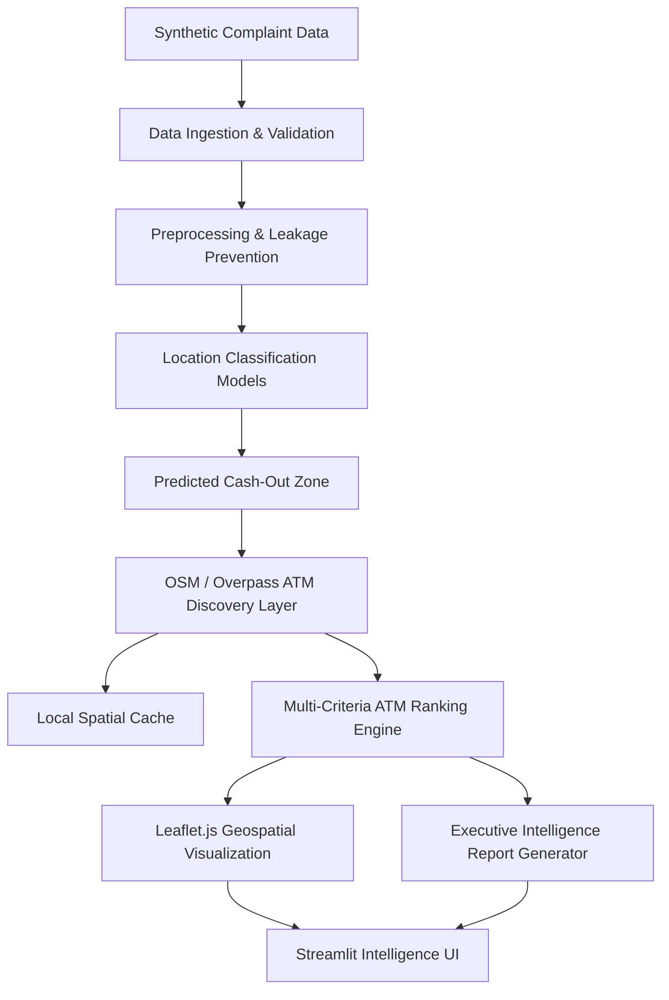

# CyberTrace System Architecture

## Overview
CyberTrace is structured as a modular, tiered intelligence platform with strict boundary separation between data access, feature preprocessing, machine learning inference, geospatial discovery, and user presentation.

## Layer Architecture

### 1. Data Layer (`src/data/`)
- `loader.py`: Safe ingestion abstraction with existence checking.
- `validator.py`: Comprehensive missingness, duplicate, and schema conformity profiling.
- `generator.py`: Synthetic benchmark generator with reproducible noise injection.

### 2. Preprocessing & Feature Engineering (`src/preprocessing/`)
- `cleaning.py`: Deduplication and missing value imputation.
- `features.py`: Temporal extraction and risk tiers.
- `pipeline.py`: ColumnTransformer pipelines with strict runtime assertion preventing target leakage.

### 3. Machine Learning Layer (`src/models/`)
- `location_model.py`: Unified object-oriented wrapper around Scikit-Learn classifiers.
- `train.py`: Stratified train/test splitting and benchmark comparison.
- `evaluate.py`: Multi-metric evaluation (Accuracy, Precision, Recall, Macro/Weighted F1, Confusion Matrix, ROC-AUC).
- `predict.py`: Inference engine returning standardized probability distributions.

### 4. Geospatial & ATM Ranking Layer (`src/geographic/`, `src/atm/`)
- `distance.py`: Mathematical Haversine calculations.
- `zones.py`: Geographic bounding boxes and centroids for target operational sectors.
- `osm_loader.py`: Overpass QL client with MD5 spatial caching on disk.
- `atm_discovery.py`: Zone-filtered POI discovery.
- `ranking.py`: Multi-criteria heuristic scoring engine.

### 5. Intelligence & Presentation Layer (`src/intelligence/`, `app/`)
- `scoring.py`: Multi-factor prioritization synthesis.
- `explanation.py`: Non-technical signal explanation and investigative advice generator.
- `report.py`: HTML/PDF brief generator.
- `app/`: Multi-page Streamlit application shell with embedded Leaflet.js maps.
