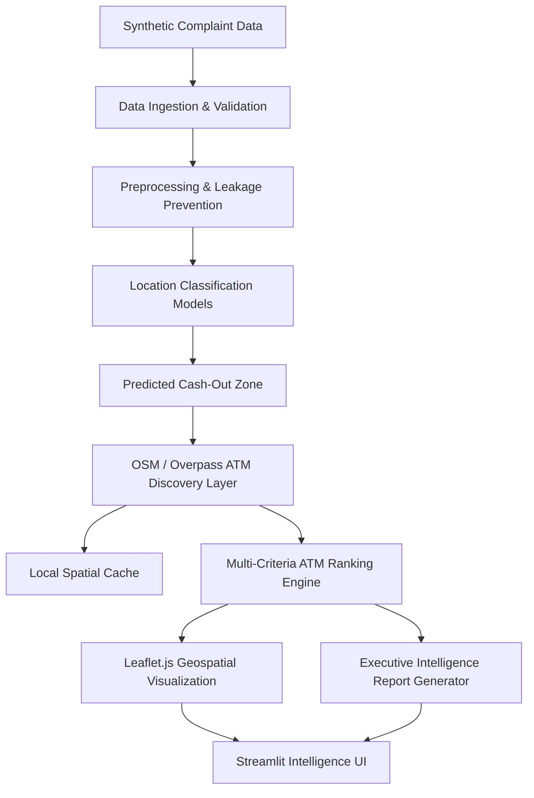

# CyberTrace System Architecture

## Overview
CyberTrace is structured as a modular, tiered intelligence platform with strict boundary separation between data access, feature preprocessing, machine learning inference, geospatial discovery, and user presentation.

## Layer Architecture

### 1. Data Layer (`src/data/`)
- `loader.py`: Safe ingestion abstraction with existence checking.
- `validator.py`: Comprehensive missingness, duplicate, and schema conformity profiling.
- `generator.py`: Synthetic benchmark generator with reproducible noise injection.

### 2. Preprocessing & Feature Engineering (`src/preprocessing/`)
- `cleaning.py`: Missing value handling, categorical normalization, numeric coordinate/amount validation, and deduplication with comprehensive auditing.
- `features.py`: Feature engineering including cyclical temporal transformations (`hour_sin`, `hour_cos`, `day_of_week_sin`, `day_of_week_cos`) and monetary log transformation (`amount_log`).
- `pipeline.py`: Leakage-safe Skikit-Learn `ColumnTransformer` builder supporting dual feature sets (`FEATURE_SET_FULL` and `FEATURE_SET_GEOGRAPHIC_BLIND`), stratified train/test split, StratifiedKFold cross-validation preparation, and balanced class weight calculation. Detailed in [docs/preprocessing.md](file:///docs/preprocessing.md).

### 3. Machine Learning Layer (`src/models/`)
- `location_model.py`: Object-oriented wrapper around Scikit-Learn pipelines supporting pipeline loading, training, prediction, and probability estimation.
- `train.py`: Pipeline constructor, 5-fold Stratified Cross-Validation orchestrator, test evaluation engine, and backward-compatible model trainer.
- `evaluate.py`: Multi-metric evaluation (Accuracy, Balanced Accuracy, Macro/Weighted Precision, Recall, F1, Multiclass OVR ROC-AUC) and automated dual-panel confusion matrix visualization generator.
- `predict.py`: Inference engine returning standardized probability distributions and top-k zone candidate rankings. Detailed in [docs/model_training.md](file:///docs/model_training.md).

### 4. Geospatial & ATM Ranking Layer (`src/geographic/`, `src/atm/`)
- `distance.py`: Mathematical Haversine calculations.
- `zones.py`: Geographic bounding boxes and centroids for target operational sectors.
- `analysis.py`: Target validation, spatial separation, empirical centroid computation, bounding box overlap analysis, statistical association tests, and ATM coverage analytics (implemented in Phase 3).
- `osm_loader.py`: Overpass QL client with MD5 spatial caching on disk.
- `atm_discovery.py`: Zone-filtered POI discovery.
- `ranking.py`: Multi-criteria heuristic scoring engine.

> [!NOTE]
> **Synthetic Target Disclosure**: `withdrawal_zone` is a synthetic target created for academic supervised-learning experimentation. It does not represent confirmed NCRP withdrawal locations.

### 5. Intelligence & Presentation Layer (`src/intelligence/`, `app/`)
- `scoring.py`: Multi-factor prioritization synthesis.
- `explanation.py`: Non-technical signal explanation and investigative advice generator.
- `report.py`: HTML/PDF brief generator.
- `app/`: Multi-page Streamlit application shell with embedded Leaflet.js maps.
